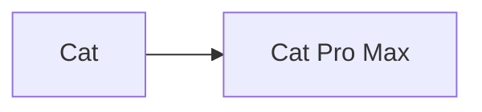
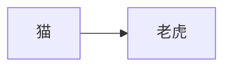
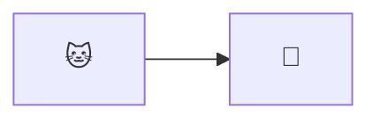
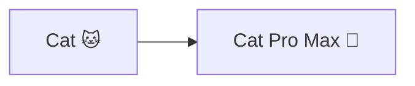
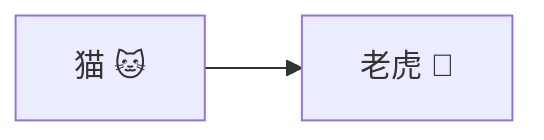

import Link from '@components/blog/Link.astro'

# {frontmatter.title}

## 1. Frontmatter 变量

本篇文章的标题是 `游乐场 | Astro MDX`，可以通过 `frontmatter.title` 获取。

> 标题：{frontmatter.title}

```mdx
> 标题：{frontmatter.title}
```

<Link
  site="https://docs.astro.build/zh-cn/guides/integrations-guide/mdx/#%E5%9C%A8-mdx-%E4%B8%AD%E4%BD%BF%E7%94%A8-frontmatter-%E5%8F%98%E9%87%8F"
  name="在 MDX 中使用 Frontmatter 变量"
  favicon="/icons/bookmarks/astro.svg"
  first={true}
/>

## 2. 纯 CSS 图标

在 MDX 中允许使用 `div` 元素，并且 UnoCSS 可以正常工作，因此可以正常使用在 `uno.config.ts` 里注册的图标集（配置方法请参考下方代码及官方链接）。

#### 1

使用 `pnpm` 安装 Astro 的 UnoCSS 集成

```zsh
pnpm add -D unocss
```

<Link site="https://unocss.dev/integrations/astro#installation" name="Astro Integration → Installation" first={true} />

#### 2

2.1 使用 `pnpm` 安装 `@unocss/reset`（用于重置浏览器样式）

```zsh
pnpm add -D @unocss/reset
```

2.2 在 `astro.config.ts` 中注册 UnoCSS 集成并重置浏览器样式

```ts
// astro.config.ts
import { defineConfig } from 'astro/config'
import UnoCSS from 'unocss/astro'

export default defineConfig({
  integrations: [
    UnoCSS({
      injectReset: true,
    }),
  ],
})
```

<Link site="https://unocss.dev/integrations/astro#style-reset" name="Astro Integration → Style Reset" first={true} />

#### 3

3.1 使用 `pnpm` 添加 `@iconify-json/logos` 图标集

```zsh
pnpm add -D @iconify-json/logos
```

<Link
  site="https://icones.js.org/collection/logos"
  name="SVG Logos"
  favicon="/icons/bookmarks/icônes.svg"
  first={true}
/>
<Link
  site="https://icones.js.org/collection/logos?s=mdx&icon=logos:mdx"
  name="logos:mdx"
  favicon="/icons/bookmarks/icônes.svg"
/>

3.2 在 `uno.config.ts` 中配置 UnoCSS 预设并注册图标集

```ts
// uno.config.ts
import { defineConfig, presetWind, presetTypography, presetIcons } from 'unocss'

export default defineConfig({
  presets: [
    presetWind(),
    presetTypography(),
    presetIcons({
      collections: {
        logos: async () => {
          const icons = await import('@iconify-json/logos/icons.json')
          return icons.default
        },
      },
    }),
  ],
})
```

<Link site="https://unocss.dev/presets/wind#wind-preset" name="Wind preset" first={true} />
<Link site="https://unocss.dev/presets/typography#typography-preset" name="Typography preset" />
<Link site="https://unocss.dev/presets/icons#icons-preset" name="Icons preset" />

#### 4

在 MDX 文件中使用

```mdx
<div class="i-logos-mdx w-26 h-26 -mb-8 -mt-8"></div>
```

显示效果如下

<div class="i-logos-mdx w-26 h-26 -mb-8 -mt-8"></div>

## 3. Mermaid 图表

> 在 Markdown 文件中也能使用！

### 用法1：使用 remark 插件 `remark-mermaidjs`

> ⭐️ 推荐：此用法生成的 Mermaid 图表文字可被选中复制，交互体验更好。

#### 1

使用 `pnpm` 添加 `remark-mermaidjs` remark 插件

```zsh
pnpm add remark-mermaidjs
```

<Link
  site="https://github.com/remcohaszing/remark-mermaidjs?tab=readme-ov-file#installation"
  name="remark-mermaidjs → Installation"
  first={true}
/>

#### 2

2.1 使用 `pnpm` 添加 `playwright` 自动化测试框架

```zsh
pnpm add playwright
```

2.2 使用 `playwright` 安装 `chromium` 浏览器和相关操作系统依赖项

```zsh
pnpm exec playwright install --with-deps chromium
```

<Link
  site="https://github.com/remcohaszing/remark-mermaidjs?tab=readme-ov-file#installation"
  name="remark-mermaidjs → Installation"
  first={true}
/>
<Link
  site="https://playwright.dev/docs/browsers#install-system-dependencies"
  name="Browsers → Install system dependencies"
  favicon="https://playwright.dev/img/playwright-logo.svg"
/>

#### 3

在 `astro.config.ts` 中注册 `remark-mermaidjs` remark 插件并配置 Mermaid 图表使用手绘风格

```ts
// astro.config.ts
import { defineConfig } from 'astro/config'
import remarkMermaid from 'remark-mermaidjs'

export default defineConfig({
  // ...
  markdown: {
    remarkPlugins: [
      [
        remarkMermaid,
        {
          mermaidConfig: {
            look: 'handDrawn',
          },
        },
      ],
    ],
  },
})
```

<Link
  site="https://docs.astro.build/zh-cn/guides/markdown-content/#%E6%B7%BB%E5%8A%A0-remark-%E5%92%8C-rehype-%E6%8F%92%E4%BB%B6"
  name="添加 remark 和 rehype 插件"
  favicon="/icons/bookmarks/astro.svg"
  first={true}
/>

#### 4

在 Markdown / MDX 文件中使用 Mermaid 图表

**英文**

````mdx

````


**简体中文**

````mdx

````


**Emoji**

````mdx

````


**英文 + Emoji**

````mdx

````


**简体中文 + Emoji**

````mdx

````


> ⚠️ 已知问题：在 Netlify 部署后会出现中文和 Emoji 渲染不全的情况（本站部署在 Netlify 上），但在本地开发环境（macOS Sequoia 15.3.1）均能正常显示。

> 💭 更新1：可能与 Netlify 用户没有权限安装 Playwright Chromium 浏览器相关操作系统依赖项有关，因为在 Koyeb 使用 Docker 部署（可以正常安装依赖）后显示效果与本地开发环境一致，可点击下方链接查看 Koyeb 的部署效果。

<div class="-mt-3">
  <Link
    site="https://leungsekyu.koyeb.app/blog/astro-mdx/"
    name="leungsekyu → 游乐场 | Astro MDX（部署在 Koyeb）"
    favicon="/favicon/favicon.svg"
  />
</div>

> 🧐 后续尝试：使用 Puppeteer 替代 Playwright 渲染 Mermaid 图表。

### 用法2：使用 Mermaid Live Editor

<Link site="https://mermaid.live/edit/" name="Mermaid Live Editor" />

> 🪧 提示：需要在桌面端浏览器打开

#### 使用方法

编辑图表后在左下方的 Actions 折叠栏中选择导出 SVG 图片或者直接使用生成的 SVG 图片 URL

**英文**

```text
%%{init: {'look': 'handDrawn'}}%%
graph LR
  A[Cat] --> B[Cat Pro Max]
```

使用导出的 SVG 图片


使用生成的 SVG 图片 URL


<div class="-mt-3 mb-7">
  <Link
    site="https://mermaid.live/edit#pako:eNo9j8EKwjAQRH9lWSi9tD-Qg6D2aEH0pulhadI22GRLTFAp_XdTRW9v4DHDzNiy0igwy2bjTBAw5yPzLReQD-RU5enh8mXJMul6T9MAh5N0ANvrnkIDZbmB3Ypw9Aw1PRss0GpvyahUOq-qxDBoqyWKhEp3FMcgUbolqRQDn1-uRRF81AV6jv2AoqPxnlKcFAVdGUrL9qdM5C7M9i9pZQL7-vvic2Z5A9cVRq0"
    name="Mermaid Live Editor → 英文"
  />
</div>

**英文 + Emoji**

```text
%%{init: {'look': 'handDrawn'}}%%
graph LR
  A[Cat 🐱] --> B[Cat Pro Max 🐯]
```

使用导出的 SVG 图片


使用生成的 SVG 图片 URL


<div class="-mt-3 mb-7">
  <Link
    site="https://mermaid.live/edit#pako:eNpFj00KwjAQha8yDJRu2gtkIfiztCC607gYmtgG20yJCSqld_AGHkG8mUcwVtDd-x5vhvd6LFlpFJgkvbHGC-jThvmYCkhrsmrh6GzTYUgSaStHXQ3LtbQA092cPLzut-ce8nwCs5FXjqGgy8d_7DHDVruWjIrv-8-RRF_rVksUUSp9oNB4idIOMUrB8-ZqSxTeBZ2h41DVKA7UnCKFTpHXC0OxQ_tzO7Jb5j9rZTy74jto3DW8AWdGTNY"
    name="Mermaid Live Editor → 英文 + Emoji"
  />
</div>

**中文 + Emoji**

```text
%%{init: {'look': 'handDrawn'}}%%
graph LR
  A[猫 🐱] --> B[老虎 🐯]
```

使用导出的 SVG 图片


使用生成的 SVG 图片 URL


<div class="-mt-3 mb-7">
  <Link
    site="https://mermaid.live/edit#pako:eNo9j7EKwjAYhF8l_FC6tC-QQVA66qKbTYefJtpgk5SYIFIKuou4OvkADuJT2dFHMCq63R0fd1wLpeECKERRK7V0lLRxbcwqpiSuUPPM4kbHXRdFTC8tNhUZT5kmZJg_DlfyvJzuBUnTARnl_W7fn4_v6FZAAkpYhZKH5vbNM3CVUIIBDZKLBfraMWC6Cyh6Z2ZbXQJ11osErPHLCugC63VwvuHoRCYxzKsf0qCeG6P-kODSGTv5Xvk86l5lAE3a"
    name="Mermaid Live Editor → 中文 + Emoji"
  />
</div>

> ⚠️ 已知问题：使用导出的 SVG 图片会在移动端出现 Emoji 右侧有少许遮挡的情况，原因不明。

### 总结

无论采用哪种用法，均建议使用英文，兼容性最好。
