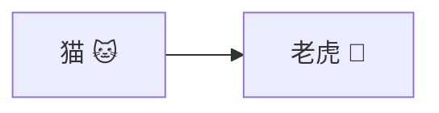
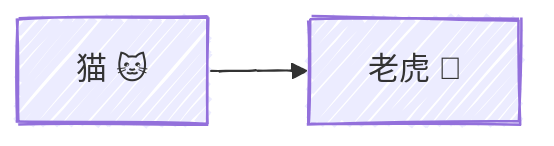
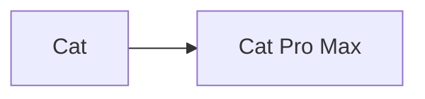
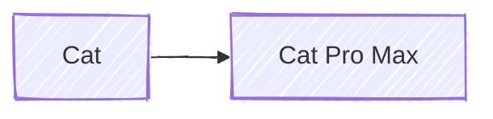

import Link from '@components/blog/Link.astro'

# {frontmatter.title}

## 1. Frontmatter 变量

本篇文章的标题是 `游乐场 | Astro MDX`，可以通过 `frontmatter.title` 获取。

> 标题：**{frontmatter.title}**

```mdx
标题：**{frontmatter.title}**
```

<Link
  site="https://docs.astro.build/zh-cn/guides/integrations-guide/mdx/#%E5%9C%A8-mdx-%E4%B8%AD%E4%BD%BF%E7%94%A8-frontmatter-%E5%8F%98%E9%87%8F"
  name="在 MDX 中使用 Frontmatter 变量"
  favicon="https://leungsekyu.com/icons/bookmarks/astro.svg"
  first={true}
/>

## 2. 纯 CSS 图标

在 **MDX** 中允许使用 `div` 元素，并且 **UnoCSS** 可以正常工作，因此可以正常使用在 `uno.config.ts` 里配置的图标集（配置方法请参考下方代码及链接）。

1. 使用 `pnpm` 安装 **Astro** 的 **UnoCSS** 集成和 `@iconify-json/logos` 图标集：

```zsh
pnpm add -D unocss @iconify-json/logos
```

2. 配置 `astro.config.ts`：

```ts
// astro.config.ts
import { defineConfig } from 'astro/config'
import UnoCSS from 'unocss/astro'

export default defineConfig({
  integrations: [
    UnoCSS({
      injectReset: true
    }),
  ],
})
```

3. 配置 `uno.config.ts`：

```ts
// uno.config.ts
import { defineConfig, presetWind, presetTypography, presetIcons } from 'unocss'

export default defineConfig({
  presets: [
    presetWind(),
    presetTypography(),
    presetIcons({
      collections: {
        logos: async () => {
          const icons = await import('@iconify-json/logos/icons.json')
          return icons.default
        },
      },
    }),
  ],
})
```

4. 在 **MDX** 文件中使用：

```mdx
<div class="i-logos-mdx w-26 h-26 -mt-6 -mb-5"></div>
```

5. 效果：

<div class="i-logos-mdx w-26 h-26 -mt-6 -mb-5"></div>

<Link
  site="https://unocss.dev/integrations/astro"
  name="Astro Integration"
  first={true}
/>
<Link
  site="https://unocss.dev/presets/icons#icons-preset"
  name="Icons preset"
/>
<Link
  site="https://icones.js.org/collection/logos"
  name="SVG Logos"
  favicon="https://leungsekyu.com/icons/bookmarks/icônes.svg"
/>
<Link
  site="https://icones.js.org/collection/logos?s=mdx&icon=logos:mdx"
  name="logos:mdx"
  favicon="https://leungsekyu.com/icons/bookmarks/icônes.svg"
/>

## 3. Mermaid 图表（在 Markdown 文件中也能使用！）

### 用法1：使用 `remark-mermaidjs` 插件 + `Playwright` 渲染（推荐）

> ⚠️ 已知问题：在 **Netlify** 部署后会出现中文和 **Emoji** 渲染不全的情况，在本地开发环境（**macOS 15.1.1**）均能正常显示。

<Link
  site="https://github.com/remcohaszing/remark-mermaidjs"
  name="remark-mermaidjs"
  first={true}
/>

### 用法2：使用 Mermaid Live Editor 导出 SVG

### 对比

#### 中文（使用 remark-mermaidjs 插件渲染）



#### 中文（使用 Mermaid Live Editor 导出 SVG）



````mdx

````

#### 英文（使用 remark-mermaidjs 插件渲染）



````mdx

````

### 踩坑经过

其实 Mermaid 图表最简单的用法是在 Mermaid Live Editor 中编辑，然后在左下方的 Action 折叠栏中
选择下载 SVG 图片或者直接使用生成的 SVG URL

待续 ...  
(Markdown Remark 插件的配置)  
(Markdown Remark 插件的链接)  
(Playwright 的安装)

<Link
  site="https://mermaid.live/edit"
  name="Mermaid Live Editor"
  first={true}
/>
