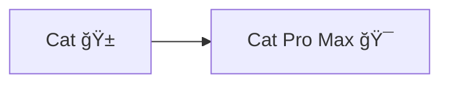

# {frontmatter.title}

## 标题

```mdx
// 学习笔记 | Astro MDX

# {frontmatter.title}
```

[Astro → 在 MDX 中使用 Frontmatter 变量](https://docs.astro.build/zh-cn/guides/integrations-guide/mdx/#%E5%9C%A8-mdx-%E4%B8%AD%E4%BD%BF%E7%94%A8-frontmatter-%E5%8F%98%E9%87%8F)

## 图标

<div class="i-logos-mdx h-24 w-24"></div>

```html
<div class="i-logos-mdx h-24 w-24"></div>
```

[UnoCSS → Icons preset](https://unocss.dev/presets/icons#icons-preset)  
[Icônes → SVG Logos](https://icones.js.org/collection/logos)

## 流程图



````mdx

```mermaid
%%{init: {'look': 'handDrawn'}}%%
graph LR
  A[Cat 🐱] --> B[Cat Pro Max 🐯]
```

````
