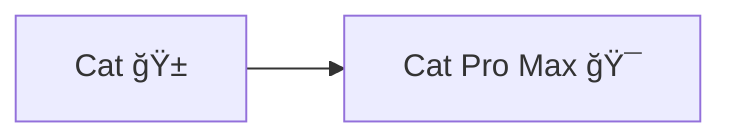

import Mermaid from '@components/blog/Mermaid.astro'

# {frontmatter.title}

## 标题

```mdx
// 学习笔记 | Astro MDX

# {frontmatter.title}
```

[Astro | 在 MDX 中使用 Frontmatter 变量](https://docs.astro.build/zh-cn/guides/integrations-guide/mdx/#%E5%9C%A8-mdx-%E4%B8%AD%E4%BD%BF%E7%94%A8-frontmatter-%E5%8F%98%E9%87%8F)

## 图标

<div class="i-logos-mdx h-24 w-24"></div>

```html
<div class="i-logos-mdx h-24 w-24"></div>
```

[UnoCSS | Icons preset](https://unocss.dev/presets/icons#icons-preset)  
[Icônes | SVG Logos](https://icones.js.org/collection/logos)

## 流程图



````mdx

```mermaid
%%{init: {'look': 'handDrawn'}}%%
graph LR
  A[Cat 🐱] --> B[Cat Pro Max 🐯]
```

````

test： 使用 remark-mermaidjs 服务器端渲染 svg



```mermaid
graph TD
  A[user]
    B[å¸å· 1]
      B --> B1[folder 1]
      B --> B2[文件夹 2]
    C[account 2]
      C --> C1[文件夹 1]
      C --> C2[文件夹 2]
  A --> B
  A --> C
```

test：使用 Mermaid 组件

<Mermaid
  code={`
graph TD
  A[user]
    B[帐号 1]
      B --> B1[folder 1]
      B --> B2[文件夹 2 🐯]
    C[account 2]
      C --> C1[文件夹 1]
      C --> C2[文件夹 2]
  A --> B
  A --> C
`}
/>
test：使用 Mermaid Live Editor 生成的 SVG（没有规定字体）

