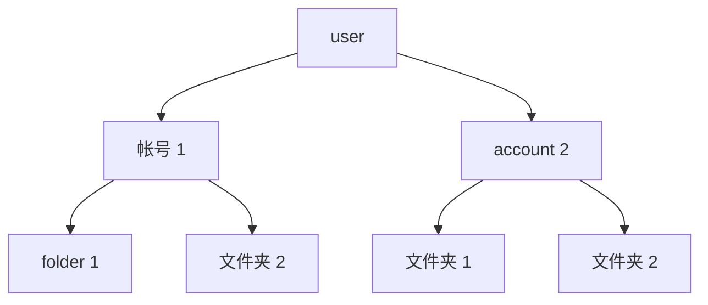

# Sui Move 101

## 1. 新建项目

```zsh
sui move new filling
```

延伸链接：[Your First Sui dApp | Write a Move Package](https://docs.sui.io/guides/developer/first-app/write-package)

## 2. 模板

### 2.1 Sui 官网模板

[Move Conventions | Body](https://docs.sui.io/concepts/sui-move-concepts/conventions#body)

### 2.2 Anne 模板

```move
// === Dependencies ===
// === Constants ===
// === Error Codes ===
// === Structs ===
// === Event Structs ===
// === Init ===
// === Entry Functions ===
// === Getter Functions ===
```

## 3. VSCode 插件

[Move Analyzer VS Code Extension](https://docs.sui.io/references/ide/move)


