# Sui Move 101

## 1. 新建项目

```zsh
sui move new filling
```

延伸链接：[Your First Sui dApp | Write a Move Package](https://docs.sui.io/guides/developer/first-app/write-package)

## 2. 模板

### 2.1 Sui 官网模板

[Move Conventions | Body](https://docs.sui.io/concepts/sui-move-concepts/conventions#body)

### 2.2 Anne 模板

```move
// === Dependencies ===
// === Constants ===
// === Error Codes ===
// === Structs ===
// === Event Structs ===
// === Init ===
// === Entry Functions ===
// === Getter Functions ===
```

## 3. VSCode 插件

[Move Analyzer VS Code Extension](https://docs.sui.io/references/ide/move)

```mermaid
%%{init: {'look': 'handDrawn'}}%%
graph TD
  A[用户]
    B[帐号 1]
      B --> B1[文件夹 1]
      B --> B2[文件夹 2]
    C[帐号 2]
      C --> C1[文件夹 1]
      C --> C2[文件夹 2 📁]
  A --> B
  A --> C
```


