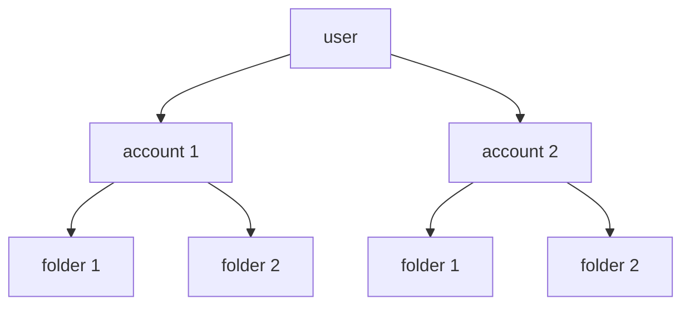

import Link from '@components/blog/Link.astro'
import YouTube from '@components/blog/YouTube.astro'
import Bilibili from '@components/blog/Bilibili.astro'

# {frontmatter.title}

<YouTube url="https://www.youtube.com/embed/kysdlsL6_uE?si=q6etxhz7GHFLyQk3" />

<Link
  site="https://www.bilibili.com/video/BV1k46GY5E8n"
  name="前端共学营Week·1_第1讲：Sui 资源管理合约与基础操作"
  first={true}
/>

<Link site="https://github.com/hoh-zone/0.1-to-Sui-Fullstack" name="从0.1开始Sui全栈开发者计划" />

---

### Week 1

#### 学习内容：Sui 资源管理合约与基础操作

- [ ] 1. Sui 和 Move 的快速概览
- [ ] 2. Move 的核心语法和功能
- [ ] 3. 理解 Sui 对象模型
- [ ] 4. 测试你的代码

#### 自习内容：React 入门

- [ ] 1️⃣ React 的基本概念：什么是组件、JSX 语法
- [ ] 2️⃣ 函数组件 vs 类组件
- [ ] 3️⃣ Props 和 State 的使用
- [ ] 4️⃣ React 的生命周期和 Hooks（重点：useState 和 useEffect）
- [ ] 5️⃣ 列表渲染：map 函数
- [ ] 6️⃣ 表单处理和事件绑定

#### Task 1

- [ ] 编写一个简单的资源管理合约，并通过 React.js 进行交互，展示合约的基本操作。

提交链接：https://github.com/hoh-zone/0.1-to-Sui-Fullstack

---

## 1. 新建项目

```zsh
sui move new filling
```

<Link
  site="https://docs.sui.io/guides/developer/first-app/write-package"
  name="Write a Move Package"
  favicon="https://docs.sui.io/img/favicon.ico"
  first={true}
/>

## 2. Module Template

### Anne 模板

```move
// === Dependencies ===
// === Constants ===
// === Error Codes ===
// === Structs ===
// === Event Structs ===
// === Init ===
// === Entry Functions ===
// === Getter Functions ===
```

<Link
  site="https://docs.sui.io/concepts/sui-move-concepts/conventions"
  name="Move Conventions"
  favicon="https://docs.sui.io/img/favicon.ico"
  first={true}
/>

## 3. VS Code / Cursor 插件

在应用商店搜索 `mysten.move` 安装插件，装完会包含以下 3 个插件：

- Move
- Move Syntax
- Move Trace Debugger

<Link
  site="https://docs.sui.io/references/ide/move"
  name="Move Analyzer"
  favicon="https://docs.sui.io/img/favicon.ico"
  first={true}
/>

## 4. 数据结构


