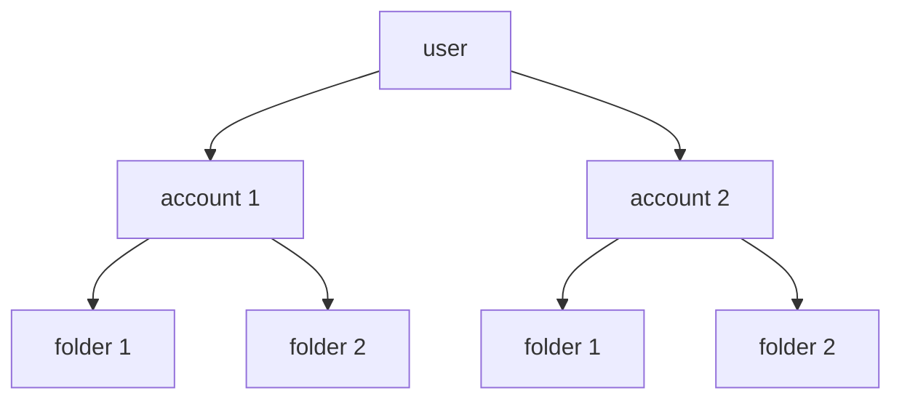

import Link from '@components/blog/Link.astro'

# Sui Move 101

## 1. 新建项目

```zsh
sui move new filling
```

<Link
  site="https://docs.sui.io/guides/developer/first-app/write-package"
  name="Write a Move Package"
  favicon="https://docs.sui.io/img/favicon.ico"
  first={true}
/>

## 2. Module Template

### Anne 模板

```move
// === Dependencies ===
// === Constants ===
// === Error Codes ===
// === Structs ===
// === Event Structs ===
// === Init ===
// === Entry Functions ===
// === Getter Functions ===
```

<Link
  site="https://docs.sui.io/concepts/sui-move-concepts/conventions"
  name="Move Conventions"
  favicon="https://docs.sui.io/img/favicon.ico"
  first={true}
/>

## 3. VS Code / Cursor 插件

在应用商店搜索 `mysten.move` 安装插件，装完会包含以下 3 个插件：

- Move
- Move Syntax
- Move Trace Debugger

<Link
  site="https://docs.sui.io/references/ide/move"
  name="Move Analyzer"
  favicon="https://docs.sui.io/img/favicon.ico"
  first={true}
/>

## 4. 数据结构


