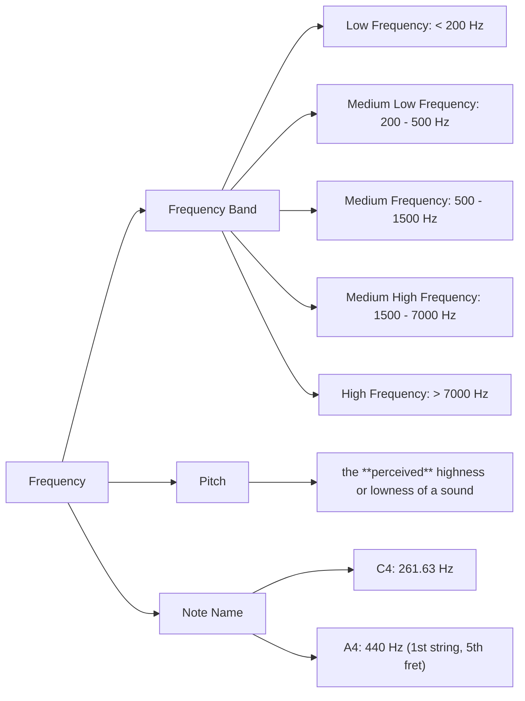

import Link from '@components/blog/Link.astro'
import Bilibili from '@components/blog/Bilibili.astro'
import YouTube from '@components/blog/YouTube.astro'

# {frontmatter.title}

<Link
  site="https://www.sylviastudio.cn/%e5%a3%b0%e6%b3%a2-%e9%a2%84%e5%a4%87%e7%9f%a5%e8%af%86/"
  name="Acoustics and Psychoacoustics Notes"
  first={true}
/>

<Link
  site="https://www.sylviastudio.cn/%e6%95%b0%e5%ad%97%e9%9f%b3%e9%a2%91%e5%9f%ba%e7%a1%80-%e5%a4%8d%e4%b9%a0%e7%ac%94%e8%ae%b0/"
  name="Digital Music Fundamentals"
/>

## 吉他

### 课程

<Link
  site="https://neomusicschool.com/p/t_pc/goods_pc_detail/goods_detail/p_619b6476e4b0c005c992b5ff"
  name="【初阶】吉他小白入门50讲"
  favicon="https://wechatapppro-1252524126.file.myqcloud.com/apppgphd3dp2971/image/b_u_6192449ea34ab_q1Ahh51i/kyignf8w0s9j.PNG"
  first={true}
/>

<Link
  site="https://neomusicschool.com/p/t_pc/course_pc_detail/video/v_61ea5340e4b02b825845759a?product_id=p_619b6476e4b0c005c992b5ff&content_app_id=&type=6"
  name="12 频率、频段、⾳⾼、⾳名（他们之间到底有什么关系？）"
/>

- 频率翻倍 → 音高高一个八度

<Link
  site="https://neomusicschool.com/p/t_pc/course_pc_detail/video/v_61ea533de4b02b8258457597?product_id=p_619b6476e4b0c005c992b5ff&content_app_id=&type=6"
  name="13 ⼗⼆平均律（玩音乐玩的就是这几个音）"
/>

### 吉他谱

<Link
  site="https://yopu.co/view/8XwRA0Y1"
  name="这条小鱼在乎"
  favicon="https://cdn.yopu.co/img/logo.bd260b19.svg"
  first={true}
/>

## Live

<YouTube url="https://www.youtube.com/embed/ogsnf_9LDqg?si=CVsf_L6hL92Af57n" />

 

<YouTube url="https://www.youtube.com/embed/yQHmIt9OVGU?si=adJS_wWY3sMaeL9r" />

## 梦想家

人间的青草地，需要浇水 🩵

<Bilibili url="//player.bilibili.com/player.html?isOutside=true&aid=113322896727747&bvid=BV1ZzyTYvEgq&cid=26339115219&p=1" />

 

<Bilibili url="//player.bilibili.com/player.html?isOutside=true&aid=546784848&bvid=BV12q4y1W7i7&cid=374503078&p=1" />
